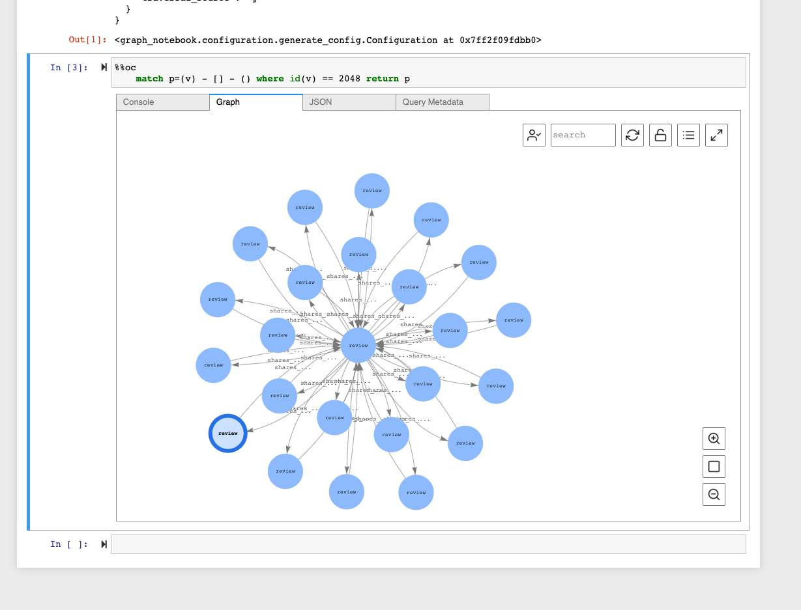

# Nebula-opencypher-adapter

An adapter for OpenCypher HTTP endpoint.

Refer: https://docs.aws.amazon.com/neptune/latest/userguide/access-graph-opencypher-queries.html

## Usage

```
go build

./nebula-opencypher-adapter -a 192.168.15.30:9669 -s yelp --port 8001

```

* Lazy Nebula connection pool

* default connection pool configurations
	* defaultMaxConnSize = 200
	* defaultMinConnSize = 10
	* defaultTimeout     = 0

* convert nebula resultset to json

